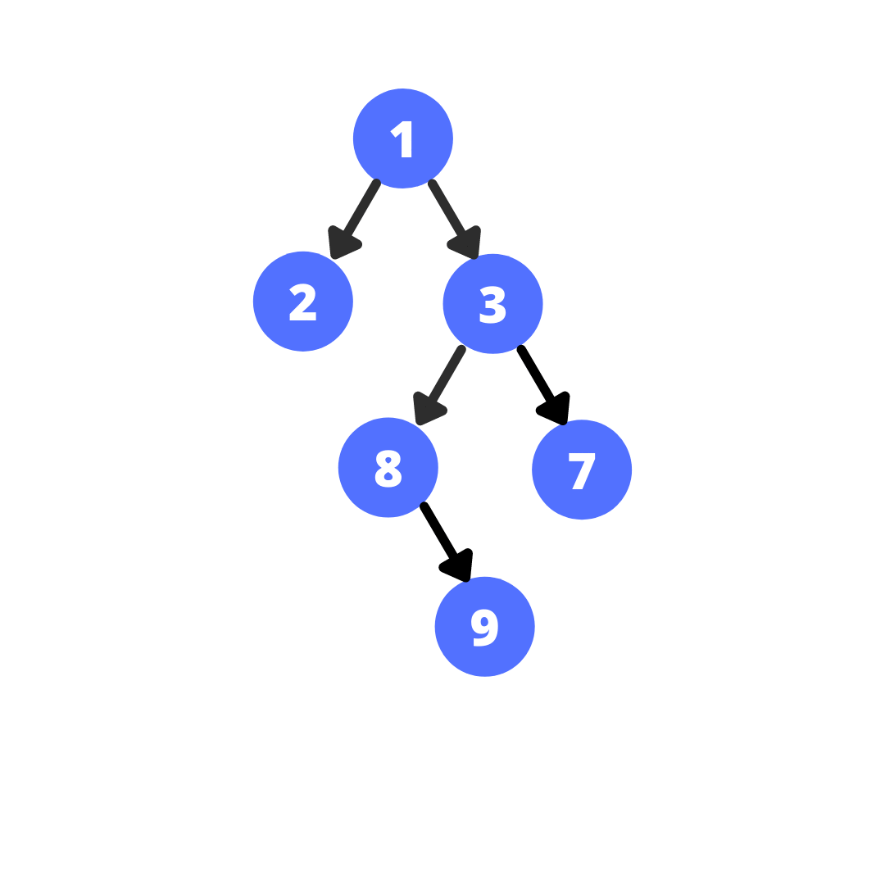
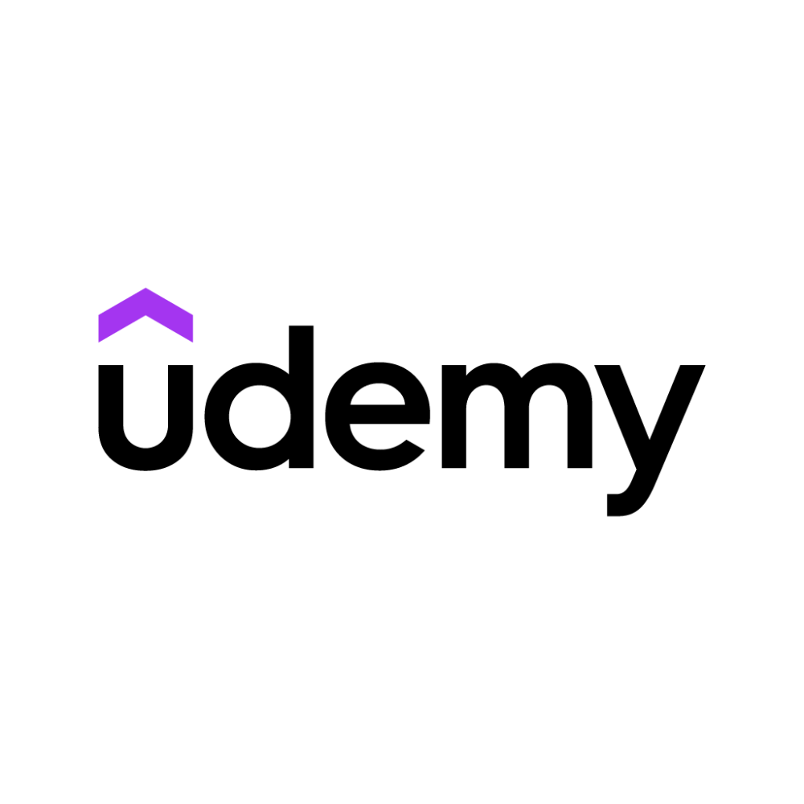

# Uppalapati Suchith Chowdary&nbsp;

  

    
  

  

    <h2>
       Suchith! Who? &nbsp;
    </h2>
    

      I am a Final Year B.Tech Undergraduate from 
      <a href="http://www.nits.ac.in"> <b> <em>National Institute of Technology, Silchar</em> </b></a>.  
        
      I am passionate about   
      <b>Software Development</b>    
      <b>Machine Learning</b>    
      <b>Data Science</b>   
      <b>Generative AI </b>.  
        
      I love collaborating on innovative projects and enjoy solving challenging problems that push the boundaries of technology.  
        
      I am constantly seeking new learning opportunities to expand my knowledge and skills in the tech field.
    

  

##   **A Little About Me – More Than Just Code!**

     I’m currently <b>Sleeping 😴</b> or working on my <b>Laptop 👨‍💻</b>
     
     On a Mission to flex <b>README</b> on my <b>Profile</b> 💪
     
     I’m looking to collaborate on <b>Python 🐍 Projects</b>
     
     <b>Pronouns:</b> <a href="https://pronoun.is/he"><b><em>He/Him</em></b></a> 🧔
     
     <b>Fun fact:</b> I can <b>Debug Code</b> faster than I can decide what to eat for <b>Lunch</b>! 🍕💻

###   **My Skill Palette**

  

    <b>Programming Languages</b>
      <ul>
          <li>Python</li>
          <li>R</li>
          <li>JavaScript</li>
          <li>C++</li>
      </ul>
  

  

      
  

  

    <b>Computer Science Fundamentals</b>
    <ul>
        <li>Data Structures and Algorithms</li>
        <li>Object-Oriented Programming in C++</li>
    </ul>
  

  

      
  

  

    <b>Domain Proficiency</b>
    <ul>
        <li>Machine Learning & Deep Learning</li>
        <li>Generative AI Technologies</li>
    </ul>
  

  

      
  

  

    <b>Databases & Tools</b>
    <ul>
        <li>MySQL & MsSQL</li>
        <li>Neo4J & Rag</li>
        <li>Version Control - Git & Github</li>
    </ul>
  

  

      
  

  

    <b>Platforms</b>
    <ul>
        <li>Figma</li>
        <li>Microsoft PowerApps</li>
        <li>Microsoft 365 (AI Tools)</li>
        <li>HuggingFace & Kaggle</li>
    </ul>
  

  

      
  

##   **Featured Projects**

<b> Reverse Engineering of Legacy Code using GenAI </b> - <a href="https://github.com/Suchith-2002/Reverse-Engineering-Legacy-Code"> <u><em> Dive into Project </em></u> </a>
- The project leverages advanced Gen AI techniques to enhance the readability, maintainability, and performance of outdated software systems.
- It includes documentation, refactoring, translation, and detection of security vulnerabilities to modernize the legacy codebase.

<b> Repeat Purchase Prediction </b> - <a href="https://github.com/Suchith-2002/Repeat-Purchase-Prediction"> <u><em> Dive into Project </em></u> </a>
- This project aims to predict whether a customer will make a repeat purchase from a seller.
- It leverages machine learning techniques to analyze user behavior and predict future purchases.

<b> WhisperWave </b> - <a href="https://github.com/Suchith-2002/WhisperWave"> <u><em> Dive into Project </em></u> </a>
- This project aims to transcribe audio from a video provided using WhisperAI.

<b> Dev Wave </b> - <a href="https://github.com/Suchith-2002/Dev-Wave"> <u><em> Dive into Project </em></u> </a>
- A Social media Web Application Developed using MERN Stack.
- A Social Network app for developers that includes authentication, profiles and forum posts.

<b> Exam Counselling Model </b> - <a href="https://github.com/Suchith-2002/Exam-Counselling-Model"> <u><em> Dive into Project </em></u> </a>
- A Project developed using Python that deals with the Seat allocation of the Students.
- An user can provide the details and get the relevant seat allocations similar to JoSAA.

<b> Perceptual Image Hashing using ResNet-50 (OnGoing) </b>
- This project aims to generate perceptual image hash codes, ensuring robust and efficient image similarity detection.
- Using the ResNet-50 architecture for feature extraction, enhancing the Robustness and Discrimination.

##   **Certifications and Achievements**

  

    <b>Advance Application Engineering Analyst</b> - <a href="https://drive.google.com/file/d/1uOzXsh1KLkYmcteosHzDawBRLhDjksGS/view?usp=sharing"> <u><em> View Certificate </em></u> </a>
    <ul>
        <li>Engaged in a two-month full-time internship, contributing to various projects.</li>
        <li>Increased proficiency in Generative AI (GenAI) and Artificial Intelligence/Machine Learning (AI/ML).</li>
    </ul>
  

  

      
  

  

    <b>DS and ML Bootcamp, Udemy</b> - <a href="https://drive.google.com/file/d/1qWndDDh2HXZvx7hcG3qHKparFz7jbFg_/view?usp=sharing"> <u><em> View Certificate </em></u> </a>
    <ul>
        <li>Gained comprehensive knowledge of data science concepts and machine learning techniques.</li>
        <li>Effective hands-on experience with key tools and frameworks.</li>
    </ul>
  

  

      
  

  

    <b>AI in Microsoft 365, Skill Nation</b> - <a href="https://drive.google.com/file/d/1tOBli_JOYbuaxxXiyWETRvPwUwXj65WV/view?usp=sharing"> <u><em> View Certificate </em></u> </a>
    <ul>
        <li>Proficient in leveraging AI-powered tools to enhance productivity and automate business workflows.</li>
        <li>Good hands-on experience with key tools and methodologies.</li>
    </ul>
  

  

      
  

  

    <b>JEE Mains</b> - <a href="https://drive.google.com/file/d/1s9s8LpfYFWRWyvL2lRRe_YBJj_JjI0L-/view?usp=sharing"> <u><em> View Certificate </em></u> </a>
    <ul>
        <li>Qualified JEE MAINS held in 2021 with an All India Rank 11437.</li>
    </ul>
  

  

      
  

  

    <b>Competitive Programming</b>
    <ul>
        <li>Solved 200+ standard problems on <a href="https://leetcode.com/u/Suchith_U/"><u><em>Leetcode</em></u></a>.</li>
        <li>Solved 350+ problems on <a href="https://codeforces.com/profile/Suchith_1124"><u><em>Codeforces</em></u></a>.</li>
    </ul>
  

  

      
  

  

    <b>ILM</b> - <a href="https://drive.google.com/file/d/1tOBli_JOYbuaxxXiyWETRvPwUwXj65WV/view?usp=sharing"> <u><em> View Certificate </em></u> </a>
    <ul>
        <li>Awarded for excellence in Language Proficiency, Communicative Skills, Foreign Manners, and Etiquette.</li>
    </ul>
  

  

      
  

##  **Real-Time Activity Stats**

  

  

  

 

##  Connect with me

<table border="0" cellspacing="0" cellpadding="0" style="border-collapse: collapse;">
  <tr>
    <td style="padding: 0 10px;">
      
    </td>
    <td style="padding: 0 10px;">
      
    </td>
    <td style="padding: 0 10px;">
      
    </td>
    <td style="padding: 0 10px;">
      
    </td>
    <td style="padding: 0 10px;">
      
    </td>
    <td style="padding: 0 10px;">
      
    </td>
    <td style="padding: 0 10px;">
      
    </td>
  </tr>
</table>

<!--
##  Connect with me

&nbsp;&nbsp;&nbsp;&nbsp;
&nbsp;&nbsp;&nbsp;&nbsp;
&nbsp;&nbsp;&nbsp;&nbsp;
&nbsp;&nbsp;&nbsp;&nbsp;
&nbsp;&nbsp;&nbsp;&nbsp;
&nbsp;&nbsp;&nbsp;&nbsp;

-->
